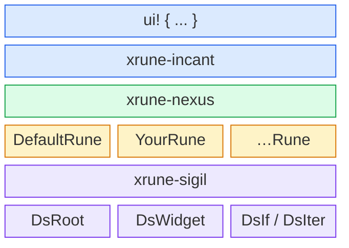

<p align="center">
  
</p>

<p align="center">
  <a href="https://github.com/W-Mai/xrune/actions"></a>
  <a href="https://crates.io/crates/xrune"></a>
  <a href="https://docs.rs/xrune"></a>
  <a href="LICENSE"></a>
</p>

<p align="center">
  <b><a href="https://xrune.to01.icu/">The Grimoire</a></b> ·
  <a href="https://xrune.to01.icu/book/">English docs</a> ·
  <a href="https://xrune.to01.icu/book/zh-CN/">中文文档</a> ·
  <a href="README.zh-CN.md">中文 README</a>
</p>

A declarative UI DSL proc macro framework with pluggable code generation backends.

## Features

- Declarative widget tree syntax with nested children
- Attribute expressions (any valid Rust expression as value)
- Enchants — attach arbitrary data to nodes via `[expr, ...]` syntax
- Context area with arbitrary key-value pairs
- Conditional rendering (`if` / `elif` / `else`)
- Iteration (`walk ... with ...`)
- Reactive control flow via the `$` sigil (`if $cond`, `match $expr`, `walk $items`)
- Pluggable codegen via `DsRune` trait — bring your own backend

## Syntax

```rust
use xrune::ui;

fn app(parent: i32) {
    ui! {
        // Context area: arbitrary key-value pairs (each attr on its own line)
        :(
            parent: parent
            world: &mut world
        :)

        // Widget with attributes
        container (width: 480, height: 320, color: "dark") {
            header (height: 40, text: "Hello") {}

            row (direction: "horizontal") {
                button (text: "OK", grow: 1.0) {}
                button (text: "Cancel", grow: 1.0) {}
            }

            // Enchants: attach data to a node
            physics_obj (x: 100, y: 200) [
                Velocity { vx: 1, vy: 0 },
                Collider::circle(10),
            ] {}

            // Iteration
            walk items.iter() with item {
                label (text: item.name) {}
            }

            // Conditional
            if show_footer {
                footer (height: 20) {}
            }
        }
    }
}
```

## Architecture



## Crates

| Crate | Description |
|-------|-------------|
| [`xrune`](https://crates.io/crates/xrune) | Main entry — re-exports everything |
| [`xrune-nexus`](https://crates.io/crates/xrune-nexus) | Core: AST + DsRune trait + decipher |
| [`xrune-incant`](https://crates.io/crates/xrune-incant) | Proc macro: `ui!` invocation |
| [`xrune-sigil`](https://crates.io/crates/xrune-sigil) | Derive macro: `DsRef` |
| [`xrune-fmt`](https://crates.io/crates/xrune-fmt) | CLI formatter for `ui! { … }` blocks |

## Custom Backend

Implement `DsRune` to generate your own code:

```rust
use xrune::ds_rune::DsRune;
use xrune::ds_node::ds_attr::DsAttr;
use xrune::ds_node::ds_on::DsOn;
use xrune::ds_node::ds_match::DsMatchArm;
use xrune::ds_node::DsTreeRef;

struct MyRune { /* ... */ }

impl DsRune for MyRune {
    fn inscribe_root(&mut self, parent_expr: &syn::Expr) { /* ... */ }

    fn inscribe_widget(
        &mut self,
        name: &syn::Ident,
        attrs: &[DsAttr],
        enchants: &[syn::Expr],   // [expr, ...] attached data
        on_handlers: &[DsOn],     // every `on EventKind` clause on this widget
        children: &[DsTreeRef],
    ) { /* ... */ }

    fn inscribe_if(
        &mut self,
        condition: &syn::Expr,
        reactive: bool,             // `if $cond` sets this
        children: &[DsTreeRef],
        else_branch: Option<&DsTreeRef>,  // `elif` (nested If) / `else` (Else node)
    ) { /* ... */ }

    fn inscribe_iter(
        &mut self,
        iterable: &syn::Expr,
        variable: &syn::Ident,
        reactive: bool,             // `walk $items` sets this
        children: &[DsTreeRef],
    ) { /* ... */ }

    fn inscribe_niche(&mut self, name: &syn::Ident, children: &[DsTreeRef]) { /* ... */ }

    fn inscribe_match(
        &mut self,
        scrutinee: &syn::Expr,
        reactive: bool,             // `match $expr` sets this
        arms: &[DsMatchArm],
    ) { /* ... */ }

    fn seal(self) -> proc_macro2::TokenStream { /* ... */ }
}
```

## Context Area

The `:( … :)` block passes arbitrary context to the Rune implementation. Each attribute sits on its own line. The `parent` key is required; all others are optional and Rune-specific.

```rust
ui! {
    :(
        parent: root_entity
        world: &mut app.world
        theme: Theme::Dark
    :)
    // ...
}
```

## License

MIT
