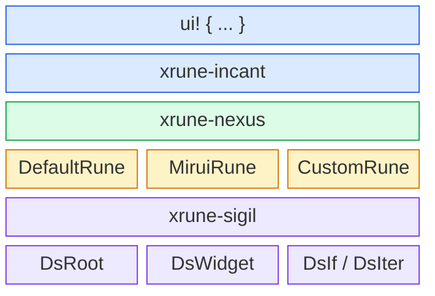

# xrune

[](https://github.com/W-Mai/xrune/actions)
[](https://crates.io/crates/xrune)
[](https://docs.rs/xrune)
[](LICENSE)

A declarative UI DSL proc macro framework with pluggable code generation backends.

## Features

- Declarative widget tree syntax with nested children
- Attribute expressions (any valid Rust expression as value)
- Conditional rendering (`if`)
- Iteration (`walk ... with ...`)
- Pluggable codegen via `DsRune` trait — bring your own backend

## Syntax

```rust
use xrune::ui;

fn app(parent: i32) {
    ui! {
        :(parent: parent:)

        container (width: 480, height: 320, color: "dark") {
            header (height: 40, text: "Hello") {}

            row (direction: "horizontal") {
                button (text: "OK", grow: 1.0) {}
                button (text: "Cancel", grow: 1.0) {}
            }

            walk items with item {
                label (text: item.name) {}
            }

            if show_footer {
                footer (height: 20) {}
            }
        }
    }
}
```

## Architecture



## Crates

| Crate | Description |
|-------|-------------|
| [`xrune`](https://crates.io/crates/xrune) | Main entry — re-exports everything |
| [`xrune-nexus`](https://crates.io/crates/xrune-nexus) | Core: AST + DsRune trait + decipher |
| [`xrune-incant`](https://crates.io/crates/xrune-incant) | Proc macro: `ui!` invocation |
| [`xrune-sigil`](https://crates.io/crates/xrune-sigil) | Derive macro: `DsRef` |

## Custom Backend

Implement `DsRune` to generate your own code:

```rust
use xrune::DsRune;

struct MyRune { /* ... */ }

impl DsRune for MyRune {
    fn inscribe_root(&mut self, parent_expr: &syn::Expr) { /* ... */ }
    fn inscribe_widget(&mut self, name: &syn::Ident, attrs: &[DsAttr], children: &[DsTreeRef]) { /* ... */ }
    fn inscribe_if(&mut self, condition: &syn::Expr, children: &[DsTreeRef]) { /* ... */ }
    fn inscribe_iter(&mut self, iterable: &syn::Expr, variable: &syn::Ident, children: &[DsTreeRef]) { /* ... */ }
    fn seal(self) -> TokenStream { /* ... */ }
}
```

## License

MIT
