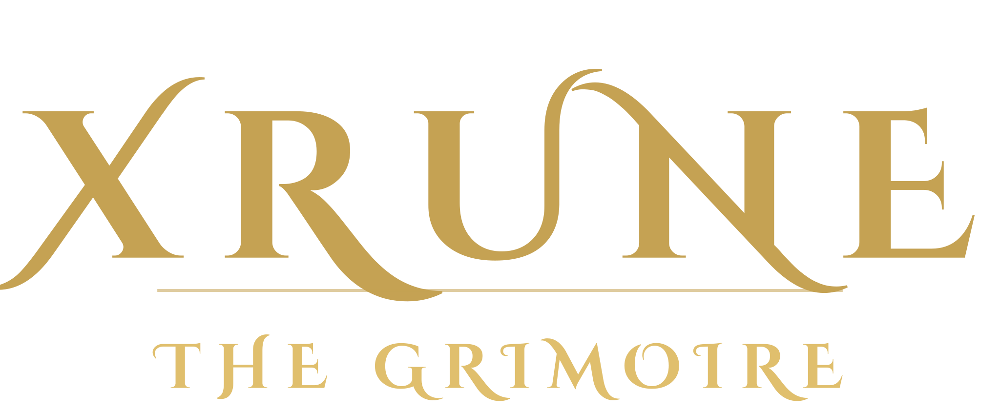
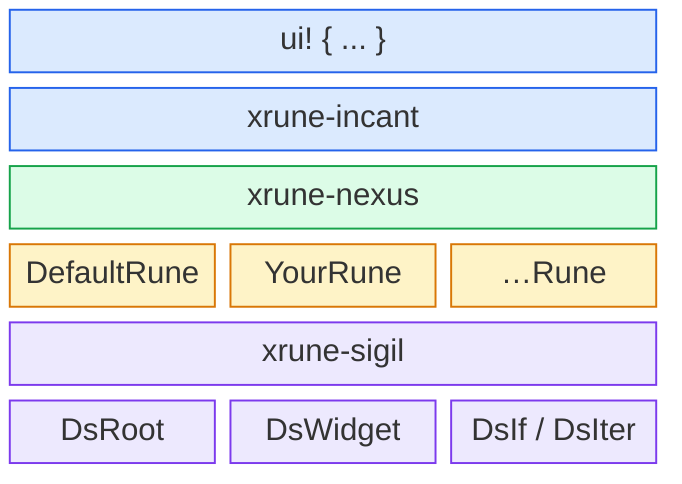

<p align="center">
  
</p>

<p align="center">
  <a href="https://github.com/W-Mai/xrune/actions"></a>
  <a href="https://crates.io/crates/xrune"></a>
  <a href="https://docs.rs/xrune"></a>
  <a href="LICENSE"></a>
</p>

<p align="center">
  <b><a href="https://xrune.to01.icu/">魔典</a></b> ·
  <a href="https://xrune.to01.icu/book/zh-CN/">中文文档</a> ·
  <a href="https://xrune.to01.icu/book/">English docs</a> ·
  <a href="README.md">English README</a>
</p>

一套声明式 UI DSL 过程宏框架，代码生成后端可插拔。

## 特性

- 声明式部件树语法，支持嵌套子节点
- 属性即表达式（任意合法 Rust 表达式皆可作属性值）
- 附魔：用 `[expr, ...]` 语法把任意数据挂到节点上
- 上下文区，承载任意键值对
- 条件渲染（`if`）
- 迭代（`walk ... with ...`）
- 经 `DsRune` trait 插拔代码生成，自带后端

## 语法

```rust
use xrune::ui;

fn app(parent: i32) {
    ui! {
        // 上下文区：任意键值对（每项属性独占一行）
        :(
            parent: parent
            world: &mut world
        :)

        // 带属性的部件
        container (width: 480, height: 320, color: "dark") {
            header (height: 40, text: "Hello") {}

            row (direction: "horizontal") {
                button (text: "OK", grow: 1.0) {}
                button (text: "Cancel", grow: 1.0) {}
            }

            // 附魔：把数据挂到节点上
            physics_obj (x: 100, y: 200) [
                Velocity { vx: 1, vy: 0 },
                Collider::circle(10),
            ] {}

            // 迭代
            walk items.iter() with item {
                label (text: item.name) {}
            }

            // 条件
            if show_footer {
                footer (height: 20) {}
            }
        }
    }
}
```

## 架构



## Crate 一览

| Crate | 说明 |
|-------|------|
| [`xrune`](https://crates.io/crates/xrune) | 聚合入口，重导出全部 |
| [`xrune-nexus`](https://crates.io/crates/xrune-nexus) | 中枢：AST + DsRune trait + decipher |
| [`xrune-incant`](https://crates.io/crates/xrune-incant) | 过程宏：`ui!` 调用 |
| [`xrune-sigil`](https://crates.io/crates/xrune-sigil) | derive 宏：`DsRef` |
| [`xrune-fmt`](https://crates.io/crates/xrune-fmt) | `ui! { … }` 块的 CLI 格式化器 |

## 自定义后端

实现 `DsRune`，生成你自己的代码：

```rust
use xrune::ds_rune::DsRune;
use xrune::ds_node::ds_attr::DsAttr;
use xrune::ds_node::ds_on::DsOn;
use xrune::ds_node::ds_match::DsMatchArm;
use xrune::ds_node::DsTreeRef;

struct MyRune { /* ... */ }

impl DsRune for MyRune {
    fn inscribe_root(&mut self, parent_expr: &syn::Expr) { /* ... */ }

    fn inscribe_widget(
        &mut self,
        name: &syn::Ident,
        attrs: &[DsAttr],
        enchants: &[syn::Expr],   // [expr, ...] 挂上来的数据
        on_handlers: &[DsOn],     // 这个部件上的每一道 `on EventKind` 子句
        children: &[DsTreeRef],
    ) { /* ... */ }

    fn inscribe_if(&mut self, condition: &syn::Expr, children: &[DsTreeRef]) { /* ... */ }

    fn inscribe_iter(
        &mut self,
        iterable: &syn::Expr,
        variable: &syn::Ident,
        children: &[DsTreeRef],
    ) { /* ... */ }

    fn inscribe_niche(&mut self, name: &syn::Ident, children: &[DsTreeRef]) { /* ... */ }

    fn inscribe_match(&mut self, scrutinee: &syn::Expr, arms: &[DsMatchArm]) { /* ... */ }

    fn seal(self) -> proc_macro2::TokenStream { /* ... */ }
}
```

## 上下文区

`:( … :)` 块向符文师传入任意上下文。每项属性独占一行。`parent` 键必填，其余皆可选、由符文师自行约定。

```rust
ui! {
    :(
        parent: root_entity
        world: &mut app.world
        theme: Theme::Dark
    :)
    // ...
}
```

## 许可证

MIT
